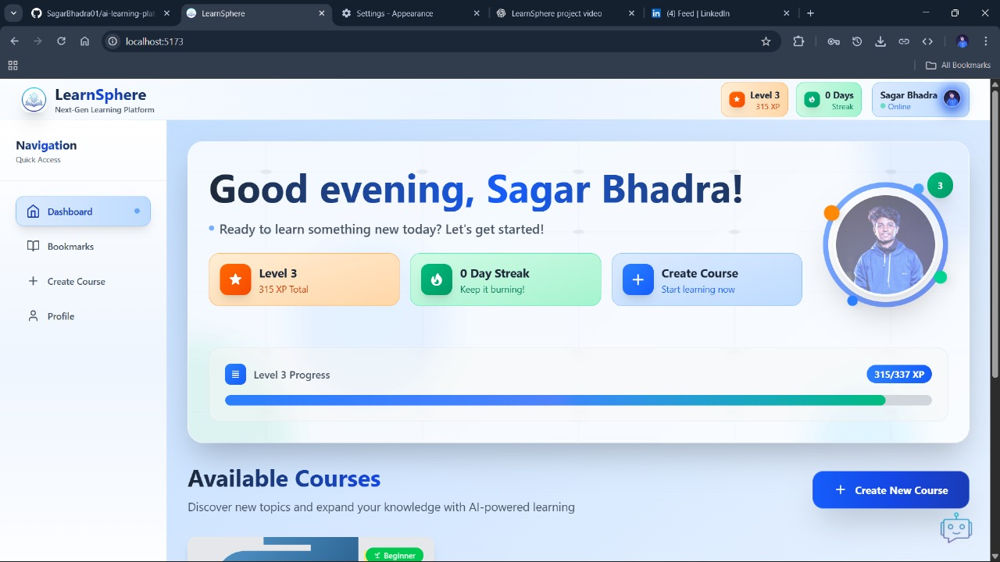
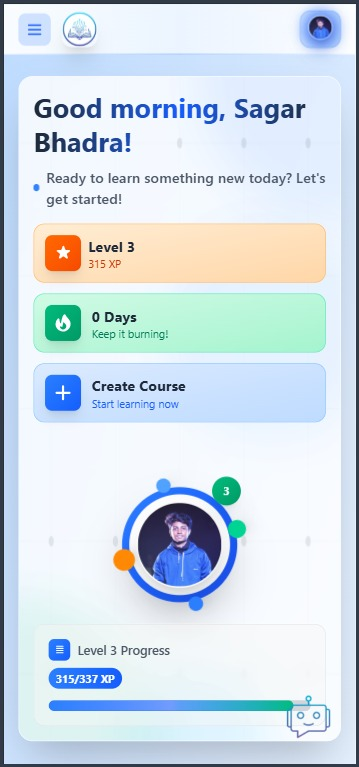
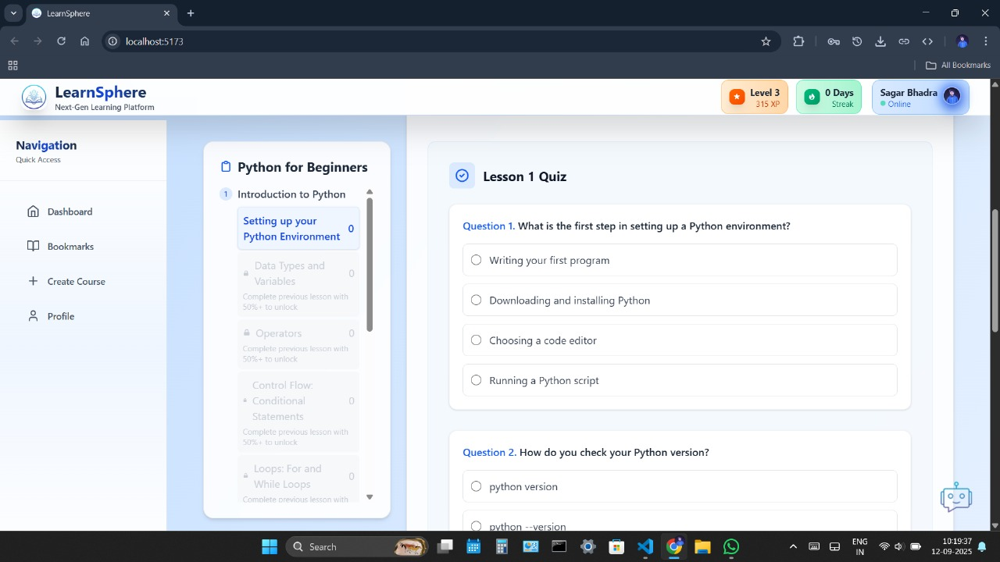
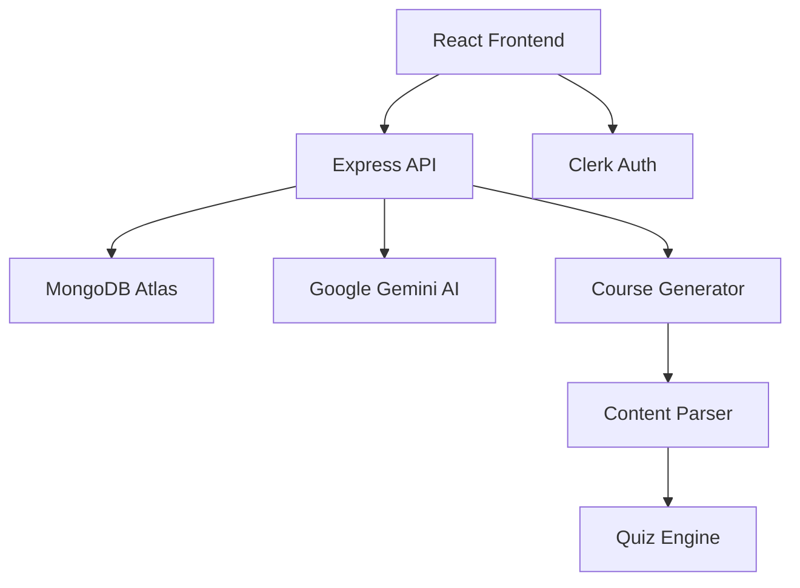

# 🚀 LearnSphere: AI-Powered Learning Platform

<div align="center">

[](https://opensource.org/licenses/MIT)
[](https://nodejs.org/)
[](https://reactjs.org/)
[](https://mongodb.com/)
[](https://typescriptlang.org/)
[](https://vitejs.dev/)

### 🎓 Transform Learning with AI-Generated Courses

*Revolutionizing education through intelligent course creation and gamified learning experiences*
</div>

---

## 🌟 Overview

LearnSphere is a cutting-edge, AI-powered learning platform that democratizes education by enabling anyone to create comprehensive, structured courses on any topic within minutes. Built with modern web technologies and powered by Google's Gemini AI, it combines intelligent content generation with gamification to deliver an engaging learning experience.

### ✨ Key Highlights

- 🤖 **AI-Powered Course Generation**: Create complete courses with structured chapters and lessons using advanced AI
- 🎮 **Gamified Learning**: XP system, levels, daily streaks, and global leaderboards
- 🔐 **Secure Authentication**: Robust user management with Clerk integration
- 📱 **Responsive Design**: Beautiful, modern UI that works seamlessly across all devices
- 🏆 **Progress Tracking**: Comprehensive learning analytics and achievement system
- 🎯 **Personalized Content**: Adaptive difficulty levels and customized learning paths

---
## Authors
 [Sagar Bhadra](https://github.com/SagarBhadra01) , [Arpan Sarkar](https://github.com/arpan7sarkar) , [Subhamoy Datta](https://github.com/subhamoydatta703)  , [Barshan Majumdar](https://github.com/Barshan-Majumdar)  , [Indrajit Bhowmik](https://github.com/indrajit-7-7) 

## 🎥 Demo & Screenshots

<div align="center">

### 🖥️ Desktop Experience


### 📱 Mobile Responsive


### 🤖 AI Course Generation


</div>

---

## 🚀 Features

### 🎯 **Core Features**
- **🤖 Intelligent Course Creation**: Generate comprehensive courses on any topic with customizable difficulty levels
- **📚 Structured Learning**: Organized chapters, lessons with rich HTML content, and interactive quizzes
- **🎮 Gamification Engine**: XP points, level progression, daily streaks, and competitive leaderboards
- **📊 Analytics Dashboard**: Track learning progress, completion rates, and performance metrics
- **🔍 Smart Search**: Find courses quickly with intelligent search and filtering

### 🛡️ **Security & Authentication**
- **🔐 Secure Login**: Multi-provider authentication via Clerk (Google, email)
- **👤 User Profiles**: Personalized dashboards with progress tracking
- **🛡️ Data Protection**: Industry-standard security practices and data encryption

### 🎨 **User Experience**
- **📱 Responsive Design**: Optimized for desktop, tablet, and mobile devices
- **⚡ Fast Loading**: Optimized performance with lazy loading and caching
- **🌐 Accessibility**: WCAG compliant with screen reader support

---

## 🏗️ Architecture & Tech Stack

<div align="center">

### 🏛️ **System Architecture**



</div>

### 🛠️ **Technology Stack**

#### **Frontend** 
- ⚛️ **React 18** with TypeScript for type-safe development
- ⚡ **Vite** for lightning-fast build and development
- 🎨 **Tailwind CSS** for modern, responsive styling
- 🔐 **Clerk** for authentication and user management
- 📡 **Axios** for API communication
- 🎭 **Lucide React** for beautiful icons

#### **Backend**
- 🟢 **Node.js** with Express.js framework
- 🍃 **MongoDB** with Mongoose ODM
- 🤖 **Google Gemini AI** for content generation
- 🔒 **JWT** for secure token management
- 🌐 **CORS** for cross-origin resource sharing

#### **Development & Deployment**
- 📦 **npm/yarn** for package management
- 🔧 **ESLint & Prettier** for code quality
- 🚀 **Vercel/Netlify** ready deployment
- 📊 **MongoDB Atlas** for cloud database

---

## 🚀 Quick Start

### 📋 **Prerequisites**

Before you begin, ensure you have the following installed:

- 📦 **Node.js** (v18.x or later)
- 🍃 **MongoDB** (local instance or MongoDB Atlas)
- 🔑 **Clerk Account** (for authentication)
- 🤖 **Google Gemini API Key**

### ⚡ **Installation**

1. **Clone the Repository**
   ```bash
   git clone https://github.com/SagarBhadra01/ai-learning-platform.git
   cd ai-learning-platform
   ```

2. **Backend Setup**
   ```bash
   cd backend
   npm install
   ```

   Create a `.env` file in the backend directory:
   ```env
   PORT=5001
   MONGO_URI=your_mongodb_connection_string
   GEMINI_API_KEY=your_google_gemini_api_key
   CLERK_SECRET_KEY=your_clerk_secret_key
   NODE_ENV=development
   ```

3. **Frontend Setup**
   ```bash
   cd ../frontend
   npm install
   ```

   Create a `.env.local` file in the frontend directory:
   ```env
   VITE_CLERK_PUBLISHABLE_KEY=your_clerk_publishable_key
   VITE_API_BASE_URL=http://localhost:5001
   VITE_GEMINI_API_KEY=your_frontend_gemini_api_key
   ```

4. **Start Development Servers**

   **Backend** (Terminal 1):
   ```bash
   cd backend
   npm run dev
   ```

   **Frontend** (Terminal 2):
   ```bash
   cd frontend
   npm run dev
   ```

5. **🎉 Access the Application**
   
   Open your browser and navigate to `http://localhost:5173`

---

## 📁 Project Structure

```
ai-learning-platform/
├── 📁 backend/                 # Express.js API Server
│   ├── 📁 models/             # MongoDB Models (User, Course, Progress)
│   ├── 📁 routes/             # API Routes (auth, courses, users)
│   ├── 📁 middleware/         # Custom Middleware (auth, validation)
│   ├── 📁 services/           # Business Logic (AI, gamification)
│   ├── 📁 config/             # Configuration Files
│   ├── 📄 server.js           # Main Server Entry Point
│   └── 📄 .env                # Environment Variables
├── 📁 frontend/               # React Frontend Application
│   ├── 📁 src/
│   │   ├── 📁 components/     # Reusable UI Components
│   │   ├── 📁 pages/          # Route Components
│   │   ├── 📁 hooks/          # Custom React Hooks
│   │   ├── 📁 services/       # API Service Layer
│   │   ├── 📁 utils/          # Helper Functions
│   │   ├── 📁 types/          # TypeScript Definitions
│   │   └── 📄 main.tsx        # Application Entry Point
│   ├── 📄 index.html          # HTML Template
│   ├── 📄 vite.config.ts      # Vite Configuration
│   └── 📄 .env.local          # Environment Variables
├── 📄 README.md               # Project Documentation
├── 📄 LICENSE                 # MIT License
└── 📄 package.json            # Root Package Configuration
```

---

## 📚 API Documentation

### 🔗 **Core Endpoints**

#### **Authentication**
```http
POST   /api/auth/register      # User Registration
POST   /api/auth/login         # User Login
GET    /api/auth/profile       # Get User Profile
PUT    /api/auth/profile       # Update Profile
```

#### **Courses**
```http
GET    /api/courses           # Get All Courses
POST   /api/courses           # Create New Course
GET    /api/courses/:id       # Get Course by ID
PUT    /api/courses/:id       # Update Course
DELETE /api/courses/:id       # Delete Course
```

#### **Learning Progress**
```http
GET    /api/progress/:userId   # Get User Progress
POST   /api/progress/complete  # Mark Lesson Complete
GET    /api/leaderboard        # Global Leaderboard
```

### 📖 **Detailed API Reference**

For comprehensive API documentation with examples, visit our [API Documentation](https://docs.learnsphere.com/api)

---

## 🎮 Gamification System

### 🏆 **XP & Leveling System**

- **📖 Course Completion**: 100-500 XP based on difficulty
- **✅ Lesson Completion**: 10-50 XP per lesson
- **🎯 Quiz Performance**: 5-25 XP based on score
- **🔥 Daily Streaks**: Bonus XP for consecutive learning days
- **🏅 Achievements**: Special XP rewards for milestones


## 🤝 Contributing

We welcome contributions from the community! Here's how you can help:

### 🛠️ **Development Setup**

1. **Fork the Repository** on GitHub
2. **Clone your Fork** locally
3. **Create a Feature Branch**: `git checkout -b feature/amazing-feature`
4. **Make your Changes** with proper commit messages
5. **Test Thoroughly** - ensure all tests pass
6. **Submit a Pull Request** with detailed description

### 📝 **Contribution Guidelines**

- 🐛 **Bug Reports**: Use GitHub Issues with detailed reproduction steps
- ✨ **Feature Requests**: Propose new ideas with clear use cases
- 💻 **Code Style**: Follow ESLint and Prettier configurations
- 🧪 **Testing**: Add tests for new features and bug fixes
- 📚 **Documentation**: Update docs for any API or feature changes

### 🎯 **Areas for Contribution**

- 🌐 **Internationalization**: Multi-language support
- 📱 **Mobile App**: React Native implementation
- 🤖 **AI Improvements**: Enhanced course generation algorithms
- 🎨 **UI/UX**: Design improvements and animations
- ⚡ **Performance**: Optimization and caching strategies

---

## 📜 License

This project is licensed under the MIT License - see the [LICENSE](LICENSE) file for details.

```
MIT License

Copyright (c) 2025 Sagar Bhadra

Permission is hereby granted, free of charge, to any person obtaining a copy
of this software and associated documentation files (the "Software"), to deal
in the Software without restriction, including without limitation the rights
to use, copy, modify, merge, publish, distribute, sublicense, and/or sell
copies of the Software, and to permit persons to whom the Software is
furnished to do so, subject to the following conditions:

The above copyright notice and this permission notice shall be included in all
copies or substantial portions of the Software.
```

---

### 🙏 **Special Thanks**

- 🤖 **Google Gemini Team** for providing powerful AI capabilities
- ⚛️ **React Community** for the amazing ecosystem
- 🔐 **Clerk Team** for seamless authentication solutions
- 🌍 **Open Source Community** for inspiration and resources

---

## 📊 Project Stats

<div align="center">


</div>

---

## 🚀 What's Next?

### 🔮 **Roadmap 2025**

- [ ] 🌐 **Multi-language Support** - Global accessibility
- [ ] 📱 **Mobile Application** - Native iOS/Android apps
- [ ] 🤝 **Collaborative Learning** - Group courses and study rooms
- [ ] 🎥 **Video Integration** - YouTube and custom video support
- [ ] 🔊 **Audio Lessons** - Text-to-speech and podcasts
- [ ] 🧠 **Advanced AI** - Personalized learning paths
- [ ] 📈 **Analytics Dashboard** - Detailed learning insights
- [ ] 💳 **Monetization** - Premium features and course marketplace

---

<div align="center">


---

**Made with ❤️ by [Sagar Bhadra](https://github.com/SagarBhadra01) , [Arpan Sarkar](https://github.com/arpan7sarkar) , [Subhamoy Datta](https://github.com/subhamoydatta703)  , [Barshan Majumdar](https://github.com/Barshan-Majumdar)  , [Indrajit Bhowmik](https://github.com/indrajit-7-7) | Powered by AI 🤖**

*"Education is the most powerful weapon which you can use to change the world." - Nelson Mandela*

</div>
